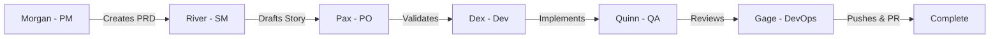
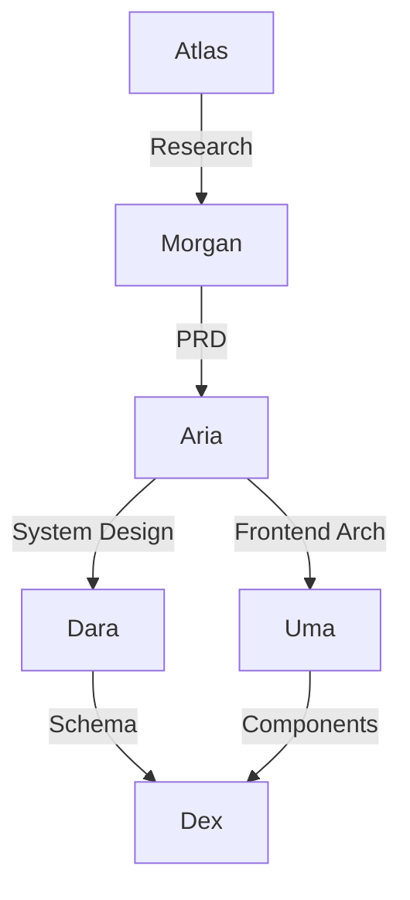

# Agents Overview

Synkra AIOX provides a specialized squad of AI agents, each designed for specific roles in the software development lifecycle. These agents work together to deliver production-ready code through coordinated workflows.

## Agent System Architecture

The agent system follows a **role-based delegation model** where each agent has:

- **Exclusive authority** over specific operations
- **Well-defined boundaries** to prevent overlap
- **Collaboration protocols** for handoffs between agents
- **Quality gates** enforced through CodeRabbit integration

## Available Agents

<CardGroup cols={3}>
  <Card title="Dex (Dev)" icon="code" href="/agents/dev">
    💻 Full Stack Developer - Code implementation and debugging
  </Card>
  
  <Card title="Quinn (QA)" icon="check-circle" href="/agents/qa">
    ✅ Test Architect - Quality assurance and comprehensive testing
  </Card>
  
  <Card title="Aria (Architect)" icon="building" href="/agents/architect">
    🏛️ System Architect - Complete system design and architecture
  </Card>
  
  <Card title="Gage (DevOps)" icon="rocket" href="/agents/devops">
    ⚡ Repository Manager - Git push, PR creation, CI/CD
  </Card>
  
  <Card title="Morgan (PM)" icon="clipboard" href="/agents/pm">
    📋 Product Manager - PRD creation and strategic planning
  </Card>
  
  <Card title="Pax (PO)" icon="target" href="/agents/po">
    🎯 Product Owner - Backlog management and story refinement
  </Card>
  
  <Card title="River (SM)" icon="wave" href="/agents/sm">
    🌊 Scrum Master - Story creation and sprint facilitation
  </Card>
  
  <Card title="Atlas (Analyst)" icon="search" href="/agents/analyst">
    🔍 Business Analyst - Market research and competitive analysis
  </Card>
  
  <Card title="Dara (Data Engineer)" icon="database" href="/agents/data-engineer">
    📊 Database Architect - Schema design and data operations
  </Card>
  
  <Card title="Uma (UX Designer)" icon="palette" href="/agents/ux-design-expert">
    🎨 UX/UI Designer - User research and design systems
  </Card>
</CardGroup>

## Activating Agents

### In Cursor IDE

```bash
# Use @ symbol to activate agents
@dev
@qa
@architect
```

### In Claude Desktop

```bash
# Use / prefix for skills
/dev
/qa
/architect
```

### In Codex CLI

```bash
# Multiple activation methods
@dev          # Direct activation
/dev          # Slash command
/dev.md       # File reference
```

## Agent Collaboration Patterns

### Story Development Flow



### Architecture & Database Flow



## Key Collaboration Rules

### 1. Git Operations Authority

**ONLY** `@devops` (Gage) can execute:
- `git push` to remote
- `gh pr create` for pull requests
- `gh pr merge` for merging

**All other agents** must delegate push operations to DevOps.

### 2. Story Lifecycle

| Phase | Agent | Command |
|-------|-------|--------|
| Create PRD | @pm | `*create-prd` |
| Draft Story | @sm | `*draft` |
| Validate Story | @po | `*validate-story-draft` |
| Implement | @dev | `*develop` |
| Review | @qa | `*review` |
| Push & PR | @devops | `*push` + `*create-pr` |

### 3. Architecture Delegation

**@architect** owns system architecture, but delegates:
- **Database schema** → @data-engineer
- **UX/UI design** → @ux-design-expert
- **Implementation** → @dev

### 4. Quality Gates

**CodeRabbit Integration** enforced by:
- **@dev**: Pre-commit review (CRITICAL issues block)
- **@qa**: Full review (CRITICAL/HIGH issues block)
- **@devops**: Pre-PR review (CRITICAL issues block PR creation)

## Permission Modes

All agents support three permission modes:

<Accordion title="Ask Mode (Default)">
**[⚠️ Ask]** - Agent asks for confirmation before executing commands.

**When to use**: Initial project setup, sensitive operations, learning the workflow.
</Accordion>

<Accordion title="Auto Mode">
**[🟢 Auto]** - Agent executes commands automatically within its authority.

**When to use**: Trusted workflows, repetitive tasks, experienced users.
</Accordion>

<Accordion title="Explore Mode">
**[🔍 Explore]** - Agent explores codebase and provides recommendations.

**When to use**: Discovery phase, optimization suggestions, learning codebase.
</Accordion>

**Toggle modes**: Use `*yolo` command with any agent.

## Common Commands

Every agent supports these core commands:

```bash
*help       # Show all available commands
*guide      # Comprehensive usage guide
*yolo       # Toggle permission mode
*exit       # Exit agent mode
```

## Agent Handoff Protocol

Agents use a **handoff artifact system** to pass context between each other:

1. Agent A completes work
2. Creates handoff artifact in `.aiox/handoffs/`
3. Next agent reads artifact on activation
4. Suggests next command based on workflow chains
5. Marks artifact as consumed

**Example**:
```yaml
# .aiox/handoffs/handoff-dev-to-qa.yaml
from_agent: dev
to_agent: qa
last_command: develop
story_id: story-1.2.3
consumed: false
```

## Quality-First Philosophy

### CodeRabbit Self-Healing

Agents automatically fix CRITICAL issues:

- **@dev**: 2 iterations max (light self-healing)
- **@qa**: 3 iterations max (full self-healing)
- **@devops**: Blocks PR if issues remain

### Story-Driven Development

All work starts with a story:

1. **Never** implement without a story
2. **Only** update authorized story sections
3. **Always** run quality gates before completion

### No Invention Rule

Agents:
- ✅ Read and execute from PRD/Architecture/Story
- ❌ Never invent requirements or features
- ✅ Ask for clarification when ambiguous

## Next Steps

<CardGroup cols={2}>
  <Card title="Start with Dev Agent" icon="code" href="/agents/dev">
    Learn how to implement stories with Dex
  </Card>
  
  <Card title="Quality Workflow" icon="check-circle" href="/agents/qa">
    Understand quality gates with Quinn
  </Card>
  
  <Card title="Architecture Guide" icon="building" href="/agents/architect">
    Design systems with Aria
  </Card>
  
  <Card title="DevOps Pipeline" icon="rocket" href="/agents/devops">
    Push and deploy with Gage
  </Card>
</CardGroup>

## Learn More

- [Command Authority Matrix](/architecture/command-authority-matrix) - Full delegation rules
- [Workflow Chains](/workflows/chains) - Automated agent sequences
- [Constitution](/core/constitution) - Core framework principles
