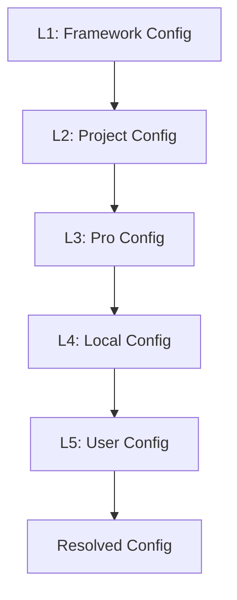

# Configuration System

AIOX uses a layered configuration system that separates framework defaults, project settings, and local overrides. This architecture enables safe customization without modifying core framework files.

## Configuration Hierarchy

Configuration is resolved from 5 layers, with higher layers overriding lower ones:



### Layer 1: Framework Configuration

**File:** `.aiox-core/framework-config.yaml`

**Purpose:** Framework defaults shipped with npm package

**Mutability:** Read-only (DO NOT EDIT)

**Git Status:** Committed (framework source)

**Contains:**
- Framework metadata and version
- Resource locations (agents, tasks, templates)
- Performance defaults
- Utility scripts registry
- IDE sync system defaults

```yaml
# Example: framework-config.yaml
metadata:
  name: "Synkra AIOX"
  framework_version: "4.0.0"

markdownExploder: true

resource_locations:
  agents_dir: ".aiox-core/development/agents"
  tasks_dir: ".aiox-core/development/tasks"
  templates_dir: ".aiox-core/development/templates"
  tools_dir: ".aiox-core/tools"
  scripts:
    core: ".aiox-core/core"
    development: ".aiox-core/development/scripts"
    infrastructure: ".aiox-core/infrastructure/scripts"

performance_defaults:
  lazy_loading:
    enabled: true
    heavy_sections:
      - pvMindContext
      - squads
      - registry
  git:
    show_config_warning: true
    cache_time_seconds: 300
```

---

### Layer 2: Project Configuration

**File:** `.aiox-core/project-config.yaml`

**Purpose:** Project-specific settings shared across the team

**Mutability:** Editable by project maintainers

**Git Status:** Committed

**Contains:**
- Project metadata
- Documentation paths
- GitHub integration settings
- CodeRabbit configuration
- Squad system settings
- Story backlog configuration

```yaml
# Example: project-config.yaml
project:
  type: EXISTING_AIOX
  installed_at: "2025-01-14T00:00:00Z"
  version: "2.1.0"

documentation_paths:
  qa_dir: "docs/qa"
  prd_file: "docs/prd.md"
  stories_dir: "docs/stories"
  dev_debug_log: ".ai/debug-log.md"
  slash_prefix: "AIOX"

github_integration:
  enabled: true
  features:
    pr_creation: true
    issue_management: true
  pr:
    title_format: "conventional"
    include_story_id: true
    conventional_commits:
      enabled: true
      default_type: "feat"

story_backlog:
  enabled: true
  location: "docs/stories/backlog"
  prioritization: "value_risk"
```

---

### Layer 3: Pro Configuration

**File:** `.aiox-core/pro-config.yaml`

**Purpose:** AIOX Pro feature settings

**Mutability:** Managed by Pro activation

**Git Status:** Committed

**Contains:**
- Pro feature flags
- Enterprise integrations
- Advanced workflow settings

<Note>
  This layer is only present when AIOX Pro is installed.
</Note>

---

### Layer 4: Local Configuration

**File:** `.aiox-core/local-config.yaml`

**Purpose:** Machine-specific settings and secrets

**Mutability:** Per-developer customization

**Git Status:** NOT committed (in `.gitignore`)

**Contains:**
- IDE selection
- MCP server configuration
- Local paths and preferences
- Machine-specific secrets

```yaml
# Example: local-config.yaml
ide:
  selected:
    - vscode
    - codex
    - claude-code
  configs:
    vscode: true
    codex: true
    claude-code: true

mcp:
  enabled: true
  configLocation: .claude/mcp.json
  docker_mcp:
    enabled: true
    gateway:
      transport: http
      url: http://localhost:8080/mcp
      port: 8080
    defaultPreset: minimal
```

---

### Layer 5: User Configuration

**File:** `~/.aiox/user-config.yaml`

**Purpose:** Cross-project user preferences

**Mutability:** User-controlled

**Git Status:** Outside project (in home directory)

**Contains:**
- User profile mode (bob/advanced)
- Default AI model
- Default language
- Educational mode preferences

```yaml
# Example: ~/.aiox/user-config.yaml
user_profile: "advanced"
default_model: "claude-sonnet"
default_language: "pt-BR"
educational_mode: false
coderabbit_integration: true
```

---

## Configuration Resolution

Configuration values are resolved using **deep merge** with **higher layers winning**:

1. Start with L1 (framework defaults)
2. Merge L2 (project settings)
3. Merge L3 (pro settings, if present)
4. Merge L4 (local overrides)
5. Merge L5 (user preferences)

### Example Resolution

```yaml
# L1 (framework-config.yaml)
performance_defaults:
  git:
    cache_time_seconds: 300
    show_config_warning: true

# L2 (project-config.yaml)
# (no override)

# L4 (local-config.yaml)
performance_defaults:
  git:
    cache_time_seconds: 600  # Override

# RESOLVED:
performance_defaults:
  git:
    cache_time_seconds: 600     # From L4
    show_config_warning: true    # From L1
```

---

## Environment Variable Interpolation

Configuration files support environment variable interpolation using `${VAR_NAME}` syntax:

```yaml
mcp:
  docker_mcp:
    gateway:
      url: http://localhost:${MCP_PORT:-8080}/mcp
    defaultServers:
      - name: exa
        config:
          apiKeys:
            EXA_API_KEY: ${EXA_API_KEY}
```

**Features:**
- **Required variables**: `${VAR}` - fails if not set
- **Default values**: `${VAR:-default}` - uses default if not set
- **Nested interpolation**: Supported in strings and paths

<Warning>
  Environment variables are interpolated at **runtime**, not at file load time. Ensure required variables are set before running AIOX commands.
</Warning>

---

## Configuration Commands

### Show Resolved Configuration

```bash
# Show full resolved config
aiox config show

# Show specific layer
aiox config show --level framework
aiox config show --level project
aiox config show --level local

# Show with source annotations
aiox config show --debug
```

**Debug mode output:**
```
project.type = EXISTING_AIOX  [L2: project-config.yaml]
project.version = 2.1.0  [L2: project-config.yaml]
performance_defaults.git.cache_time_seconds = 600  [L4: local-config.yaml]
```

---

### Compare Configuration Levels

```bash
# Compare framework vs project
aiox config diff --levels framework,project

# Compare project vs local
aiox config diff --levels project,local
```

**Example output:**
```
Differences: framework vs project
============================================================
  + github_integration: {...}  [only in project]
  + story_backlog: {...}  [only in project]
  ~ documentation_paths.stories_dir:
      framework: "docs/stories"
      project: "docs/stories/backlog"

Total: 3 difference(s)
```

---

### Migrate Legacy Configuration

Migrate monolithic `core-config.yaml` to layered files:

```bash
# Preview migration
aiox config migrate --dry-run

# Perform migration
aiox config migrate
```

**Migration process:**
1. Reads `core-config.yaml`
2. Splits into L1, L2, L4 sections
3. Creates backup (`core-config.yaml.backup`)
4. Writes `framework-config.yaml`, `project-config.yaml`, `local-config.yaml`
5. Updates `.gitignore` to exclude `local-config.yaml`
6. Validates that resolved config matches original

---

### Validate Configuration

```bash
# Validate all config files
aiox config validate

# Validate specific level
aiox config validate --level project
```

**Validation checks:**
- YAML syntax errors
- Environment variable pattern linting
- Required fields presence
- Type validation

---

### Initialize Local Configuration

```bash
aiox config init-local
```

Creates `local-config.yaml` from template and adds to `.gitignore`.

---

## Configuration Sections

### Section 1: Project Metadata

**Level:** L1 (framework portion) + L2 (project portion)

```yaml
# L1: Framework metadata
metadata:
  name: "Synkra AIOX"
  framework_version: "4.0.0"

# L2: Project metadata
project:
  type: EXISTING_AIOX
  installed_at: "2025-01-14T00:00:00Z"
  version: "2.1.0"
```

---

### Section 2: Documentation Paths

**Level:** L2 (project)

```yaml
documentation_paths:
  qa_dir: "docs/qa"
  prd_file: "docs/prd.md"
  prd_version: "v4"
  stories_dir: "docs/stories"
  dev_debug_log: ".ai/debug-log.md"
```

---

### Section 3: Resource Locations

**Level:** L1 (framework)

```yaml
resource_locations:
  agents_dir: ".aiox-core/development/agents"
  tasks_dir: ".aiox-core/development/tasks"
  templates_dir: ".aiox-core/development/templates"
  tools_dir: ".aiox-core/tools"
```

---

### Section 4: IDE Configuration

**Level:** L4 (local)

```yaml
ide:
  selected:
    - vscode
    - codex
    - claude-code
  configs:
    vscode: true
    codex: true
    claude-code: true
```

---

### Section 5: MCP Configuration

**Level:** L4 (local)

```yaml
mcp:
  enabled: true
  configLocation: .claude/mcp.json
  docker_mcp:
    enabled: true
    gateway:
      transport: http
      url: http://localhost:8080/mcp
```

---

### Section 6: Performance Settings

**Level:** L1 (defaults) + L4 (overrides)

```yaml
performance_defaults:
  lazy_loading:
    enabled: true
    heavy_sections:
      - pvMindContext
      - squads
  git:
    cache_time_seconds: 300
```

---

### Section 7: Logging & Status

**Level:** L2 (project)

```yaml
logging:
  decision_logging:
    enabled: true
    location: ".ai/"
    format: "adr"
  project_status:
    enabled: true
    auto_load_on_agent_activation: true
```

---

### Section 8: GitHub Integration

**Level:** L2 (project)

```yaml
github_integration:
  enabled: true
  features:
    pr_creation: true
  pr:
    title_format: "conventional"
    include_story_id: true
```

---

## Best Practices

### 1. Never Edit L1 (Framework Config)

<Warning>
  Framework configuration is read-only. Override values in L2 (project) or L4 (local) instead.
</Warning>

```yaml
# ❌ DON'T: Edit framework-config.yaml
# ✅ DO: Override in project-config.yaml
performance_defaults:
  git:
    cache_time_seconds: 600  # Your custom value
```

---

### 2. Commit L2, Ignore L4

**Commit to git:**
- `framework-config.yaml` (L1)
- `project-config.yaml` (L2)
- `pro-config.yaml` (L3, if using Pro)

**Add to `.gitignore`:**
- `local-config.yaml` (L4)
- `~/.aiox/user-config.yaml` (L5, outside project)

---

### 3. Use Environment Variables for Secrets

```yaml
# ✅ Good: Use environment variables
mcp:
  defaultServers:
    - name: exa
      config:
        apiKeys:
          EXA_API_KEY: ${EXA_API_KEY}

# ❌ Bad: Hardcode secrets
mcp:
  defaultServers:
    - name: exa
      config:
        apiKeys:
          EXA_API_KEY: "sk-abc123"  # DON'T DO THIS!
```

---

### 4. Validate After Changes

```bash
# Validate all config files
aiox config validate

# Show resolved config to verify changes
aiox config show --debug
```

---

### 5. Document Project Overrides

Add comments to explain project-specific settings:

```yaml
# project-config.yaml
github_integration:
  enabled: true
  pr:
    # Our team uses squash-merge workflow
    title_format: "conventional"
    # Include story ID for traceability
    include_story_id: true
```

---

## Troubleshooting

### Configuration Not Applied

1. Check layer precedence:
   ```bash
   aiox config show --debug
   ```

2. Verify file syntax:
   ```bash
   aiox config validate
   ```

3. Check for typos in keys (config uses `snake_case`)

---

### Environment Variables Not Interpolating

1. Verify variable is set:
   ```bash
   echo $EXA_API_KEY
   ```

2. Check syntax:
   ```yaml
   # ✅ Correct
   api_key: ${API_KEY}
   
   # ❌ Incorrect
   api_key: $API_KEY
   api_key: {API_KEY}
   ```

3. Use defaults for optional variables:
   ```yaml
   port: ${PORT:-8080}
   ```

---

### Migration Failed

1. Check for backup:
   ```bash
   ls -la .aiox-core/core-config.yaml.backup
   ```

2. Restore and retry:
   ```bash
   cp .aiox-core/core-config.yaml.backup .aiox-core/core-config.yaml
   aiox config migrate --dry-run
   ```

---

## Next Steps

<CardGroup cols={2}>
  <Card title="CLI Commands" icon="terminal" href="/cli/commands">
    Explore all CLI commands
  </Card>
  <Card title="Workflows" icon="diagram-project" href="/cli/workflows">
    Learn about workflow automation
  </Card>
  <Card title="Validation" icon="check-circle" href="/cli/validation">
    Understand quality gates
  </Card>
  <Card title="Configuration Schema" icon="file-code" href="/reference/config-schema">
    View full configuration schema
  </Card>
</CardGroup>
