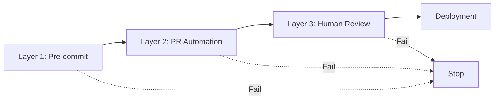

# Validation & Quality Gates

AIOX provides comprehensive validation and quality assurance through installation integrity checks and a 3-layer quality gate system.

## Installation Validation

Validate AIOX installation integrity by comparing installed files against the install manifest.

### Quick Validation

```bash
# Validate current installation
aiox validate

# Validate with detailed file list
aiox validate --detailed

# Quick validation (skip hash check)
aiox validate --no-hash
```

**Example output:**
```
✓ Validation complete

✅ Installation Integrity Report

Status: PASSED
Integrity Score: 100%

Manifest:
  Version: 4.0.0
  Files: 847
  Total Size: 12.5 MB

Validation Results:
  ✓ All files present (847/847)
  ✓ All hashes verified (847/847)
  ✓ No corrupted files
  ✓ No extra files

Duration: 2.3s
```

---

## Validation Options

### Basic Validation

<ParamField path="--detailed" type="flag">
  Show detailed file list with status for each file
</ParamField>

<ParamField path="--no-hash" type="flag">
  Skip hash verification (faster, presence-only check)
</ParamField>

<ParamField path="--extras" type="flag">
  Detect extra files not in manifest
</ParamField>

<ParamField path="--verbose" type="flag">
  Enable verbose output with progress updates
</ParamField>

<ParamField path="--json" type="flag">
  Output results as JSON for CI/CD pipelines
</ParamField>

---

### Repair Mode

<ParamField path="--repair" type="flag">
  Automatically repair missing or corrupted files
</ParamField>

<ParamField path="--dry-run" type="flag">
  Preview repairs without applying (use with `--repair`)
</ParamField>

<ParamField path="--source" type="string">
  Source directory for repairs (defaults to npm package location)
</ParamField>

---

## Validation Checks

The validator performs the following checks:

### 1. Manifest Verification

**Check:** `install-manifest.yaml` exists and is valid YAML

**Location:** `.aiox-core/install-manifest.yaml`

**Contains:**
- Framework version
- Installation timestamp
- File list with paths and hashes
- Total file count and size

```yaml
# Example manifest structure
version: 4.0.0
installedAt: '2026-03-05T12:00:00Z'
files:
  - path: .aiox-core/constitution.md
    hash: sha256:abc123...
    size: 4521
  - path: bin/aiox.js
    hash: sha256:def456...
    size: 12345
stats:
  totalFiles: 847
  totalSize: 13107200
```

---

### 2. File Presence Check

**Check:** All files in manifest exist on disk

**Status Codes:**
- ✅ `PRESENT` - File exists
- ❌ `MISSING` - File not found

**Example:**
```bash
aiox validate --detailed

# Output:
✅ .aiox-core/constitution.md
✅ bin/aiox.js
❌ .aiox-core/core/config/config-resolver.js  [MISSING]
```

---

### 3. Hash Verification

**Check:** File contents match expected SHA-256 hash

**Status Codes:**
- ✅ `VALID` - Hash matches
- ⚠️ `MODIFIED` - Hash mismatch (customized)
- ❌ `CORRUPTED` - Hash mismatch (unexpected)

<Note>
  Files in `.aiox-core/data/` are expected to be customized and will show `MODIFIED` status without failing validation.
</Note>

**Skip hash check for speed:**
```bash
aiox validate --no-hash
```

---

### 4. Extra Files Detection

**Check:** Files exist in `.aiox-core/` but not in manifest

**Enable:** Use `--extras` flag

```bash
aiox validate --extras

# Output:
⚠️ Extra files detected:
  .aiox-core/custom-script.js
  .aiox-core/test-data.json
```

---

## Repair Functionality

Automatically repair missing or corrupted files from source.

### Repair Missing Files

```bash
# Preview repairs
aiox validate --repair --dry-run

# Perform repairs
aiox validate --repair
```

**Example output:**
```
✓ 3 file(s) repaired

Repaired files:
  ✓ .aiox-core/core/config/config-resolver.js
  ✓ .aiox-core/core/quality-gates/quality-gate-manager.js
  ✓ bin/aiox-init.js

Duration: 1.2s
```

---

### Repair Source Detection

AIOX automatically detects source directory from:

1. `--source <dir>` flag (explicit)
2. npm package root (if installed via npm)
3. `node_modules/aiox-core/` (local installation)

**Specify custom source:**
```bash
aiox validate --repair --source /path/to/aiox-core
```

---

### Repair Limitations

<Warning>
  Repair functionality cannot restore:
  - Customized files (intentionally modified)
  - Files deleted manually
  - Files with permission issues
</Warning>

**Check repair failures:**
```bash
aiox validate --repair

# Output:
Failed to repair:
  ✗ .aiox-core/custom-agent.md: File is customized
  ✗ .aiox-core/protected.js: Permission denied
```

---

## JSON Output for CI/CD

Use `--json` flag for structured output:

```bash
aiox validate --json
```

**Example JSON output:**
```json
{
  "status": "passed",
  "integrityScore": 100,
  "manifestVerified": true,
  "timestamp": "2026-03-05T12:00:00Z",
  "duration": 2345,
  "manifest": {
    "version": "4.0.0",
    "installedAt": "2026-03-01T10:00:00Z"
  },
  "stats": {
    "totalFiles": 847,
    "presentFiles": 847,
    "missingFiles": 0,
    "corruptedFiles": 0,
    "validHashes": 847,
    "modifiedFiles": 0
  },
  "summary": "All files present and verified",
  "recommendations": [],
  "issueCount": 0
}
```

---

## Quality Gate System

AIOX implements a 3-layer quality gate system with fail-fast behavior.



---

## Layer 1: Pre-commit Checks

Fast, local validation before commit.

**Configuration:** `.aiox-core/core/quality-gates/quality-gate-config.yaml`

### Checks Enabled

<AccordionGroup>
  <Accordion title="Lint Check">
    **Command:** `npm run lint`
    
    **Timeout:** 60 seconds
    
    **Fail On:** Errors (warnings allowed)
    
    ```bash
    # Run manually
    npm run lint
    ```
  </Accordion>
  
  <Accordion title="Type Check">
    **Command:** `npm run typecheck`
    
    **Timeout:** 120 seconds
    
    **Fail On:** Type errors
    
    ```bash
    # Run manually
    npm run typecheck
    ```
  </Accordion>
  
  <Accordion title="Test Suite">
    **Command:** `npm test`
    
    **Timeout:** 300 seconds (5 minutes)
    
    **Coverage:** Minimum 80%
    
    ```bash
    # Run manually
    npm test
    ```
  </Accordion>
</AccordionGroup>

### Configuration Example

```yaml
# quality-gate-config.yaml
layer1:
  enabled: true
  failFast: true  # Stop on first failure
  checks:
    lint:
      enabled: true
      command: "npm run lint"
      failOn: "error"
      timeout: 60000
    test:
      enabled: true
      command: "npm test"
      timeout: 300000
      coverage:
        enabled: true
        minimum: 80
    typecheck:
      enabled: true
      command: "npm run typecheck"
      timeout: 120000
```

---

## Layer 2: PR Automation

External tools for automated code review.

### CodeRabbit Integration

**Command:** `wsl bash -c 'cd ${PROJECT_ROOT} && ~/.local/bin/coderabbit --prompt-only -t uncommitted'`

**Timeout:** 900 seconds (15 minutes)

**Severity Handling:**
- **CRITICAL** - Block merge
- **HIGH** - Warn, require review
- **MEDIUM** - Document as tech debt
- **LOW** - Ignore

```yaml
layer2:
  enabled: true
  coderabbit:
    enabled: true
    blockOn: ["CRITICAL"]
    warnOn: ["HIGH"]
    documentOn: ["MEDIUM"]
    ignoreOn: ["LOW"]
```

---

### Quinn (QA Agent)

**Agent:** `@qa`

**Mode:** Auto-review

**Severity:**
- **Block:** CRITICAL
- **Warn:** HIGH, MEDIUM

```yaml
layer2:
  quinn:
    enabled: true
    autoReview: true
    agentPath: ".claude/commands/AIOX/agents/qa.md"
    severity:
      block: ["CRITICAL"]
      warn: ["HIGH", "MEDIUM"]
```

---

## Layer 3: Human Review

Manual strategic review.

### Review Requirements

<ParamField path="requireSignoff" type="boolean" default="true">
  Require human sign-off before merge
</ParamField>

<ParamField path="assignmentStrategy" type="enum" default="auto">
  Reviewer assignment: `auto`, `manual`, or `round-robin`
</ParamField>

<ParamField path="defaultReviewer" type="string" default="@architect">
  Default reviewer when auto-assignment is used
</ParamField>

### Review Checklist

**Template:** `strategic-review-checklist`

**Minimum Items:** 5

**Example Checklist:**
- [ ] Architecture aligns with system design
- [ ] Security best practices followed
- [ ] Performance impact assessed
- [ ] Documentation updated
- [ ] Tests cover edge cases

### Sign-off Expiry

**Duration:** 24 hours (86400000 ms)

Sign-offs expire if code changes after approval.

```yaml
layer3:
  enabled: true
  requireSignoff: true
  assignmentStrategy: "auto"
  defaultReviewer: "@architect"
  checklist:
    enabled: true
    template: "strategic-review-checklist"
    minItems: 5
  signoff:
    required: true
    expiry: 86400000  # 24 hours
```

---

## Quality Gate Reports

### Report Location

**Directory:** `.aiox/qa-reports/`

**Format:** JSON, YAML, or Markdown

**Retention:** 30 days

### Example Report

```json
{
  "timestamp": "2026-03-05T12:00:00Z",
  "story": "story-123",
  "layers": {
    "layer1": {
      "status": "passed",
      "checks": {
        "lint": { "status": "passed", "duration": 3200 },
        "typecheck": { "status": "passed", "duration": 8500 },
        "test": { "status": "passed", "coverage": 87.5, "duration": 42000 }
      }
    },
    "layer2": {
      "status": "passed",
      "coderabbit": { "status": "passed", "issues": 0 },
      "quinn": { "status": "passed", "issues": 0 }
    },
    "layer3": {
      "status": "pending",
      "reviewer": "@architect",
      "checklistComplete": false
    }
  },
  "overallStatus": "in_progress"
}
```

---

## Quality Gate Commands

### Run Pre-push Quality Gate

```bash
# Run all Layer 1 checks
aiox qa run --layer 1

# Run specific check
aiox qa run --check lint

# Run with verbose output
aiox qa run --verbose
```

---

### Check Quality Gate Status

```bash
# Show current QA status
aiox qa status

# Show status for specific story
aiox qa status --story story-123

# Output as JSON
aiox qa status --json
```

**Example output:**
```
✅ Quality Gate Status

Story: story-123
Overall Status: PASSED

Layer 1 (Pre-commit): ✅ PASSED
  ✓ Lint: PASSED (3.2s)
  ✓ Type Check: PASSED (8.5s)
  ✓ Tests: PASSED (42.0s, 87.5% coverage)

Layer 2 (PR Automation): ✅ PASSED
  ✓ CodeRabbit: PASSED (0 issues)
  ✓ Quinn: PASSED (0 issues)

Layer 3 (Human Review): ⏳ PENDING
  Reviewer: @architect
  Checklist: 3/5 items complete
```

---

## Best Practices

### 1. Run Validation Before Commits

```bash
# Before committing
aiox validate
aiox qa run --layer 1

# Then commit
git add .
git commit -m "feat: add new feature"
```

---

### 2. Fix Issues Immediately

Don't accumulate quality gate failures:

```bash
# If validation fails
aiox validate --repair

# If quality gate fails
aiox qa run --fix
```

---

### 3. Monitor Quality Metrics

```bash
# View quality trends
aiox metrics show --quality

# Check coverage trends
aiox metrics show --coverage
```

---

### 4. Customize Quality Gates

Adjust thresholds for your project:

```yaml
# .aiox-core/core/quality-gates/quality-gate-config.yaml
layer1:
  checks:
    test:
      coverage:
        minimum: 90  # Increase from 80%
```

---

### 5. Use Repair Sparingly

Repair is for emergencies, not regular workflow:

```bash
# ✅ Good: Investigate first
aiox validate --detailed
# Review what's missing, then repair

# ❌ Bad: Blind repair
aiox validate --repair
```

---

## Troubleshooting

### Validation Fails with MISSING Files

1. Check if files were accidentally deleted:
   ```bash
   aiox validate --detailed
   ```

2. Repair missing files:
   ```bash
   aiox validate --repair
   ```

3. If repair fails, reinstall:
   ```bash
   npx aiox-core install --force
   ```

---

### Hash Verification Fails

1. Check if file was intentionally customized:
   ```bash
   aiox validate --detailed
   ```

2. If customized, add to exceptions in `project-config.yaml`

3. If corrupted, repair:
   ```bash
   aiox validate --repair
   ```

---

### Quality Gate Times Out

1. Increase timeout in config:
   ```yaml
   layer1:
     checks:
       test:
         timeout: 600000  # 10 minutes
   ```

2. Or skip slow checks temporarily:
   ```yaml
   layer1:
     checks:
       test:
         enabled: false
   ```

---

### CodeRabbit Not Found

1. Check installation:
   ```bash
   which coderabbit
   # or on WSL:
   wsl which coderabbit
   ```

2. Install if missing:
   ```bash
   pip install coderabbit-cli
   ```

3. Or disable gracefully:
   ```yaml
   layer2:
     coderabbit:
       enabled: false
   ```

---

## Exit Codes

### Validation Exit Codes

- **`0`** - Validation passed
- **`1`** - Validation failed (missing/corrupted files)
- **`2`** - Validation error (could not complete)

### Quality Gate Exit Codes

- **`0`** - All checks passed
- **`1`** - One or more checks failed

---

## Next Steps

<CardGroup cols={2}>
  <Card title="CLI Commands" icon="terminal" href="/cli/commands">
    Explore all CLI commands
  </Card>
  <Card title="Configuration" icon="sliders" href="/cli/configuration">
    Configure quality gates
  </Card>
  <Card title="Workflows" icon="diagram-project" href="/cli/workflows">
    Integrate with workflows
  </Card>
  <Card title="Doctor Command" icon="stethoscope" href="/cli/commands#doctor">
    Run health diagnostics
  </Card>
</CardGroup>
