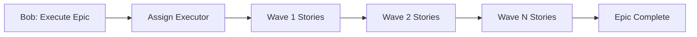
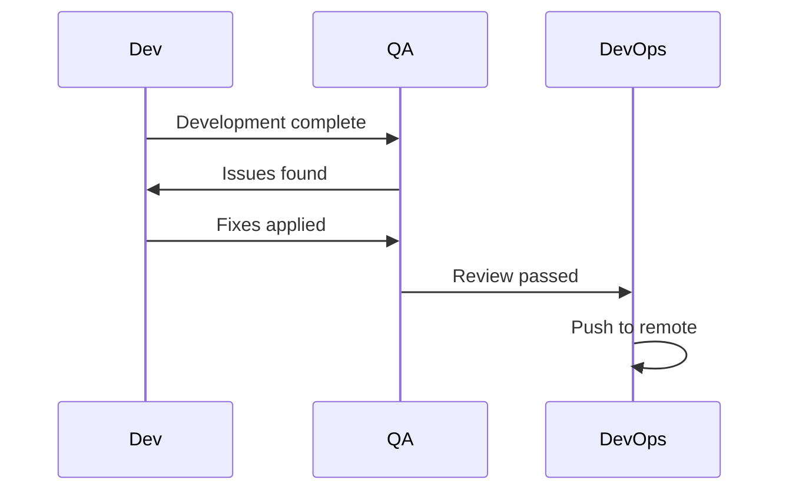

# Workflow Patterns

AIOX defines common workflow patterns that automate multi-agent collaboration. These patterns detect context from command history and suggest next steps.

## Story Development Cycle (Primary)

The most common workflow for feature development.

```mermaid
flowchart LR
    A[@sm: Draft Story] --> B[@po: Validate]
    B --> C[@dev: Develop]
    C --> D[@qa: Review]
    D --> E[@devops: Push]
    D -.Fix Issues.-> C
```

### Workflow Steps

<Steps>
  <Step title="Story Creation">
    **Agent:** `@sm` (Scrum Master)
    
    **Command:** `*draft` or `*create-story`
    
    **Output:** Story file (Draft status)
    
    **Condition:** Epic context available
  </Step>
  
  <Step title="Story Validation">
    **Agent:** `@po` (Product Owner)
    
    **Command:** `*validate-story-draft {story-id}`
    
    **Output:** GO/NO-GO decision
    
    **Condition:** Story status is Draft
  </Step>
  
  <Step title="Development">
    **Agent:** `@dev` (Developer)
    
    **Command:** `*develop {story-id}` or `*develop-yolo {story-id}`
    
    **Output:** Implementation complete
    
    **Condition:** Story status is Approved
    
    **Alternatives:**
    - `*develop-yolo` - Autonomous mode, no interruptions
    - `*develop-interactive` - Checkpoints for review
    - `*develop-preflight` - Plan first, execute later
  </Step>
  
  <Step title="QA Review">
    **Agent:** `@qa` (Quality Assurance)
    
    **Command:** `*review {story-id}` or `*gate {story-id}`
    
    **Output:** PASS/CONCERNS/FAIL/WAIVED
    
    **Condition:** Story status is Ready for Review
  </Step>
  
  <Step title="Deployment">
    **Agent:** `@devops` (DevOps)
    
    **Command:** `*push` or `*github-pr-automation`
    
    **Output:** Code pushed to remote
    
    **Condition:** QA gate PASS
  </Step>
</Steps>

### Example Execution

```bash
# 1. Create story from epic
@sm *draft epic-123

# 2. Validate story
@po *validate-story-draft story-123

# 3. Develop (autonomous mode)
@dev *develop-yolo story-123

# 4. QA review
@qa *review story-123

# 5. Push to remote
@devops *push
```

---

## QA Loop (Iterative Review)

Automated review-fix cycle after initial QA gate.

```mermaid
flowchart LR
    A[@qa: Review] --> B{Verdict}
    B -->|APPROVE| C[Done]
    B -->|REJECT| D[@dev: Fix]
    B -->|BLOCKED| E[Escalate]
    D --> A
```

### Workflow Steps

<Steps>
  <Step title="QA Review">
    **Agent:** `@qa`
    
    **Command:** `*review {story-id}`
    
    **Output:** APPROVE/REJECT/BLOCKED
    
    **Max Iterations:** 5
  </Step>
  
  <Step title="Apply Fixes">
    **Agent:** `@dev`
    
    **Command:** `*apply-qa-fixes` or `*fix-qa-issues`
    
    **Output:** Fixes applied
    
    **Condition:** QA verdict is REJECT
  </Step>
  
  <Step title="Re-review">
    **Agent:** `@qa`
    
    **Command:** `*review {story-id}`
    
    **Output:** Re-review verdict
    
    **Condition:** Fixes applied
  </Step>
</Steps>

### Example Execution

```bash
# 1. Initial review
@qa *review story-123
# Output: REJECT - 3 issues found

# 2. Fix issues
@dev *apply-qa-fixes

# 3. Re-review
@qa *review story-123
# Output: APPROVE
```

---

## Spec Pipeline (Pre-Implementation)

Transform informal requirements into executable specification.

```mermaid
flowchart TD
    A[@pm: Gather Requirements] --> B[@architect: Analyze Impact]
    B --> C{Complexity}
    C -->|SIMPLE| D[@pm: Write Spec]
    C -->|STANDARD/COMPLEX| E[@analyst: Research]
    E --> D
    D --> F[@qa: Critique Spec]
    F --> G{Verdict}
    G -->|APPROVED| H[@architect: Plan]
    G -->|NEEDS_REVISION| D
```

### Workflow Steps

<Steps>
  <Step title="Gather Requirements">
    **Agent:** `@pm` (Project Manager)
    
    **Command:** `*gather-requirements`
    
    **Output:** `requirements.json`
  </Step>
  
  <Step title="Analyze Impact">
    **Agent:** `@architect`
    
    **Command:** `*analyze-impact`
    
    **Output:** `complexity.json` (SIMPLE/STANDARD/COMPLEX)
    
    **Skip If:** SIMPLE complexity
  </Step>
  
  <Step title="Research (Optional)">
    **Agent:** `@analyst`
    
    **Command:** `*research {topic}`
    
    **Output:** `research.json`
    
    **Condition:** STANDARD or COMPLEX class
  </Step>
  
  <Step title="Write Specification">
    **Agent:** `@pm`
    
    **Command:** `*write-spec`
    
    **Output:** `spec.md`
  </Step>
  
  <Step title="Critique Specification">
    **Agent:** `@qa`
    
    **Command:** `*critique-spec {story-id}`
    
    **Output:** APPROVED/NEEDS_REVISION/BLOCKED
  </Step>
  
  <Step title="Implementation Planning">
    **Agent:** `@architect`
    
    **Command:** `*plan`
    
    **Output:** `implementation.yaml`
    
    **Condition:** Critique verdict is APPROVED
  </Step>
</Steps>

---

## Brownfield Discovery

10-phase technical debt assessment for existing codebases.

```mermaid
flowchart TD
    A[@architect: Analyze Brownfield] --> B[@data-engineer: DB Audit]
    B --> C[@ux-design-expert: Frontend Audit]
    C --> D[@qa: Review Assessments]
    D --> E[@pm: Create Epic]
```

### Workflow Steps

<Steps>
  <Step title="Architecture Analysis">
    **Agent:** `@architect`
    
    **Command:** `*analyze-brownfield`
    
    **Output:** `system-architecture.md`
  </Step>
  
  <Step title="Database Audit">
    **Agent:** `@data-engineer`
    
    **Command:** `*db-schema-audit`
    
    **Output:** `SCHEMA.md` + `DB-AUDIT.md`
    
    **Condition:** Database exists
  </Step>
  
  <Step title="Frontend Audit">
    **Agent:** `@ux-design-expert`
    
    **Command:** `*audit-frontend`
    
    **Output:** `frontend-spec.md`
    
    **Condition:** Frontend exists
  </Step>
  
  <Step title="QA Review">
    **Agent:** `@qa`
    
    **Command:** `*review`
    
    **Output:** APPROVED/NEEDS WORK
  </Step>
  
  <Step title="Epic Creation">
    **Agent:** `@pm`
    
    **Command:** `*create-epic`
    
    **Output:** Epic + stories ready for development
  </Step>
</Steps>

---

## Bob Orchestration Workflow

Bob (PM) orchestrates multi-agent workflows via executor assignment.



### Key Commands

- `*execute-epic` - Start epic execution
- `*assign-executor` - Assign executor to story
- `*wave-execute` - Execute story wave
- `*build-autonomous` - Autonomous build pipeline
- `*sync-story` - Sync story progress

### Example Execution

```bash
# Start epic
@pm *execute-epic epic-123

# Bob assigns executors and manages waves internally
# Stories are executed in dependency order

# Check status
@pm *build-status --all
```

---

## Agent Handoff Pattern

Handoff between agents during multi-agent story execution.



### Transitions

<AccordionGroup>
  <Accordion title="Dev Complete → QA Review">
    **Trigger:** `*develop` completed
    
    **Next Steps:**
    - `*review-qa {story-id}` - Run QA review
    - `*run-tests` - Run test suite
  </Accordion>
  
  <Accordion title="QA Issues Found → Fix Issues">
    **Trigger:** `*review-qa` completed with issues
    
    **Next Steps:**
    - `*fix-qa-issues` - Fix QA issues
    - `*apply-qa-fixes` - Apply QA feedback
  </Accordion>
  
  <Accordion title="Fixes Applied → Quality Gate">
    **Trigger:** `*fix-qa-issues` completed
    
    **Next Steps:**
    - `*run-tests` - Verify fixes
    - `*pre-push-quality-gate` - Run final quality gate
  </Accordion>
</AccordionGroup>

---

## Workflow Chains

AIOX maintains workflow state across sessions using state files:

**State File Location:** `.aiox/{instance-id}-state.yaml`

**State Schema:** `.aiox-core/data/workflow-state-schema.yaml`

### Workflow Commands

```bash
# Start workflow
*run-workflow {name} start

# Continue workflow
*run-workflow {name} continue

# Check status
*run-workflow {name} status

# Skip step
*run-workflow {name} skip

# Abort workflow
*run-workflow {name} abort
```

### Example Workflow State

```yaml
# .aiox/wf-sdc-123-state.yaml
workflow_id: sdc
story_id: story-123
current_step: 3
status: in_progress
steps:
  - step: 1
    agent: "@sm"
    command: "*draft"
    status: completed
    completed_at: "2026-03-05T10:00:00Z"
  - step: 2
    agent: "@po"
    command: "*validate-story-draft"
    status: completed
    completed_at: "2026-03-05T11:00:00Z"
  - step: 3
    agent: "@dev"
    command: "*develop"
    status: in_progress
    started_at: "2026-03-05T12:00:00Z"
```

---

## Hybrid Workflows (Squad + Core)

Hybrid workflows use agents from **both** core and squad contexts.

### Resolution Rules

1. Check squad agents directory first (`squads/{squad}/agents/`)
2. If not found, fall back to core agents (`.aiox-core/development/agents/`)
3. If found in both, emit `WF_AGENT_AMBIGUOUS` warning

### Explicit Prefix

Force resolution to specific context:

```yaml
workflow:
  steps:
    - agent: "core:architect"  # Force core agent
      command: "*analyze"
    - agent: "squad:validator"  # Force squad agent
      command: "*validate"
```

---

## Workflow Detection

AIOX detects active workflows from:

1. **State file** (if exists) - highest priority
2. **Command history** - pattern-based detection
3. **Git context** - branch name, recent commits

### Detection Thresholds

Minimum matching commands to detect pattern: **2**

### Example Detection

```bash
# User runs:
@po *validate-story-draft story-123
@dev *develop story-123

# AIOX detects: Story Development Cycle
# Suggests next: @qa *review story-123
```

---

## Custom Workflows

Create custom workflow patterns in `squads/{squad_name}/workflows/`:

```yaml
# squads/my-squad/workflows/custom-review.yaml
workflows:
  - id: custom-review
    name: Custom Review Workflow
    description: Custom review process
    target_context: hybrid  # Use both core and squad agents
    chain:
      - step: 1
        agent: "core:qa"
        command: "*review"
      - step: 2
        agent: "squad:security-reviewer"
        command: "*security-scan"
      - step: 3
        agent: "core:devops"
        command: "*deploy"
```

---

## Workflow Metrics

AIOX tracks workflow execution metrics:

- **Typical Duration** - Average time per workflow
- **Success Indicators** - Completion signals
- **Iteration Count** - Number of retry loops
- **Agent Transitions** - Handoff frequency

### View Metrics

```bash
# Show workflow metrics
aiox metrics show --workflow sdc

# Show all metrics
aiox metrics show --all
```

---

## Best Practices

### 1. Follow Workflow Suggestions

AIOX suggests next steps based on workflow state:

```bash
# After completing development
@dev *develop story-123

# AIOX suggests:
# Next: @qa *review story-123
```

---

### 2. Use Workflow State Files

State files persist workflow progress across sessions:

```bash
# Start workflow (creates state file)
*run-workflow sdc start

# Work on steps...
# Close session

# Resume in new session
*run-workflow sdc continue
```

---

### 3. Handle Workflow Failures

If a step fails, abort and restart:

```bash
# Abort failed workflow
*run-workflow sdc abort

# Fix issues
# ...

# Restart workflow
*run-workflow sdc start
```

---

### 4. Customize Workflows for Your Team

Create squad-specific workflows:

```bash
# Create workflow definition
vi squads/my-squad/workflows/custom.yaml

# Validate workflow
aiox workflows validate squads/my-squad/workflows/custom.yaml

# Use workflow
*run-workflow custom start
```

---

### 5. Monitor Workflow Health

```bash
# Check workflow status
aiox workflows status

# View workflow history
aiox workflows history

# Analyze workflow bottlenecks
aiox metrics show --workflow sdc --analyze
```

---

## Troubleshooting

### Workflow Not Detected

1. Check command history:
   ```bash
   history | grep aiox
   ```

2. Manually start workflow:
   ```bash
   *run-workflow sdc start
   ```

3. Check detection threshold (requires 2+ matching commands)

---

### Agent Not Found in Hybrid Workflow

1. Check agent exists:
   ```bash
   ls squads/my-squad/agents/
   ls .aiox-core/development/agents/
   ```

2. Use explicit prefix:
   ```yaml
   agent: "core:architect"
   ```

3. Check workflow validation:
   ```bash
   aiox workflows validate
   ```

---

### Workflow State Corrupted

1. Check state file:
   ```bash
   cat .aiox/wf-*-state.yaml
   ```

2. Delete and restart:
   ```bash
   rm .aiox/wf-*-state.yaml
   *run-workflow sdc start
   ```

---

## Next Steps

<CardGroup cols={2}>
  <Card title="CLI Commands" icon="terminal" href="/cli/commands">
    Explore all CLI commands
  </Card>
  <Card title="Configuration" icon="sliders" href="/cli/configuration">
    Configure workflow behavior
  </Card>
  <Card title="Validation" icon="check-circle" href="/cli/validation">
    Quality gates and validation
  </Card>
  <Card title="Agents" icon="users" href="/agents">
    Learn about AIOX agents
  </Card>
</CardGroup>
