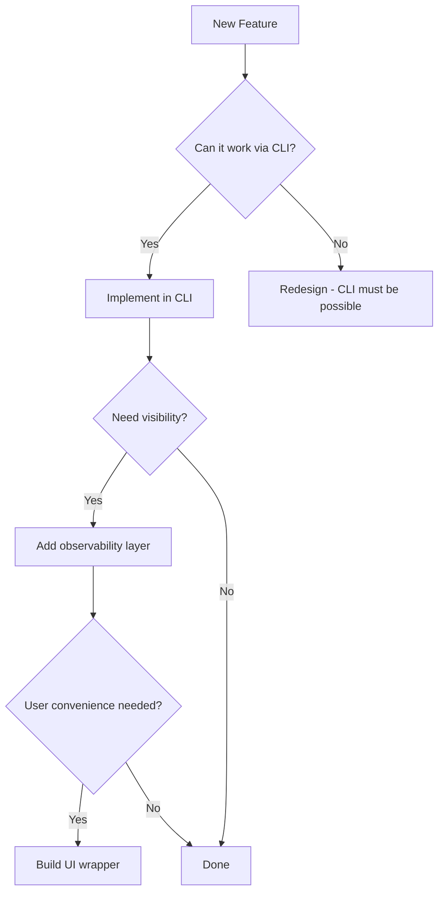

## The CLI First Principle

AIOX follows a strict **CLI First** architectural principle as defined in the [Constitution](/constitution). This means that all intelligence, execution, and automation live in the command-line interface, not in web dashboards or UIs.

<Warning>
  **Non-Negotiable Rule:** Every feature MUST work 100% via CLI before any UI is built.
</Warning>

## Architecture Hierarchy

AIOX enforces a clear hierarchy of functionality:

```
CLI (Maximum Authority)
  ↓
Observability (Secondary)
  ↓
UI (Tertiary)
```

### What This Means

<CardGroup cols={2}>
  <Card title="CLI" icon="terminal">
    **Source of Truth**
    - All workflows execute here
    - Agents run via command-line
    - No UI dependency
    - Direct file system access
  </Card>
  
  <Card title="Observability" icon="chart-line">
    **Monitoring Layer**
    - Tracks CLI execution
    - Displays metrics
    - Never controls workflows
    - Read-only by design
  </Card>
  
  <Card title="UI" icon="window">
    **Optional Interface**
    - Convenience layer only
    - Not required for operation
    - Cannot make decisions
    - Proxies to CLI
  </Card>
  
  <Card title="Dashboards" icon="gauge">
    **Passive Observers**
    - Visualize state
    - Display logs and results
    - Never execute commands
    - Cannot trigger agents
  </Card>
</CardGroup>

## Why CLI First Matters for AI Agents

AI agents like Claude, ChatGPT, and others operate in terminal environments where:

1. **Direct Execution** - Agents can invoke commands without HTTP layers
2. **File System Access** - Read/write operations are immediate and local
3. **Process Control** - Spawn subprocesses, manage state, handle errors
4. **Scriptability** - Everything is automatable and composable
5. **Version Control** - All commands and outputs are traceable

<Tip>
  UIs add latency, authentication complexity, and API dependencies that slow down agent workflows. CLI operations are instant and local.
</Tip>

## Real Example from AIOX

The main entry point `bin/aiox.js` demonstrates this principle in practice:

```javascript bin/aiox.js (lines 56-115)
// Helper: Show help
function showHelp() {
  console.log(`
AIOX-FullStack v${packageJson.version}
AI-Orchestrated System for Full Stack Development

USAGE:
  npx aiox-core@latest              # Run installation wizard
  npx aiox-core@latest install      # Install in current project
  npx aiox-core@latest init <name>  # Create new project
  npx aiox-core@latest update       # Update to latest version
  npx aiox-core@latest validate     # Validate installation integrity
  npx aiox-core@latest info         # Show system info
  npx aiox-core@latest doctor       # Run diagnostics

CONFIGURATION:
  aiox config show                       # Show resolved configuration
  aiox config show --debug               # Show with source annotations
  aiox config diff --levels L1,L2        # Compare config levels
  aiox config migrate                    # Migrate monolithic to layered
  aiox config validate                   # Validate config files
  aiox config init-local                 # Create local-config.yaml

SERVICE DISCOVERY:
  aiox workers search <query>            # Search for workers
  aiox workers search "json" --category=data
  aiox workers search "transform" --tags=etl,data
  aiox workers search "api" --format=json
`);
}
```

## Command Structure

AIOX commands follow a consistent pattern:

<CodeGroup>
```bash Installation
# Install AIOX in current project
npx aiox-core@latest install

# Create new project
npx aiox-core@latest init my-project
```

```bash Configuration
# Show configuration
aiox config show

# Validate configuration files
aiox config validate
```

```bash Diagnostics
# Run health checks
aiox doctor

# Validate installation
aiox validate
```
</CodeGroup>

## Constitutional Enforcement

From `.aiox-core/constitution.md:11-27`:

<Info>
**Regras:**
- MUST: Toda funcionalidade nova DEVE funcionar 100% via CLI antes de qualquer UI
- MUST: Dashboards apenas observam, NUNCA controlam ou tomam decisões
- MUST: A UI NUNCA é requisito para operação do sistema
- MUST: Ao decidir onde implementar, sempre CLI > Observability > UI

**Gate:** `dev-develop-story.md` - WARN se UI criada antes de CLI funcional
</Info>

## Decision Matrix

When adding new functionality, use this decision tree:



## Benefits

<AccordionGroup>
  <Accordion title="For AI Agents">
    - **Zero latency** - No HTTP round trips
    - **Direct access** - Read/write files immediately
    - **Error handling** - Clear exit codes and stderr
    - **Composability** - Chain commands with pipes
  </Accordion>
  
  <Accordion title="For Developers">
    - **Scriptable** - Integrate into any workflow
    - **Portable** - Works in any terminal
    - **Debuggable** - Use standard tools (strace, logs)
    - **Testable** - Mock stdin/stdout in tests
  </Accordion>
  
  <Accordion title="For Operations">
    - **Automatable** - CI/CD integration is trivial
    - **Monitorable** - Standard logging and metrics
    - **Reliable** - No web server dependencies
    - **Scalable** - Run thousands of instances
  </Accordion>
</AccordionGroup>

## Anti-Patterns

<Warning>
  **Don't do this:**
  - Build a web UI first, CLI later
  - Require authentication for local operations
  - Store state in a remote database
  - Make CLI depend on a running server
</Warning>

## Related Concepts

- [Agent Authority](/concepts/agent-authority) - How agents maintain exclusive capabilities
- [Workflow Orchestration](/concepts/workflow-orchestration) - CLI-based workflow execution
- [Constitution](/constitution) - Full architectural principles

<Card title="Learn More" icon="book" href="/getting-started/installation">
  See how CLI First works in practice with the installation guide
</Card>
