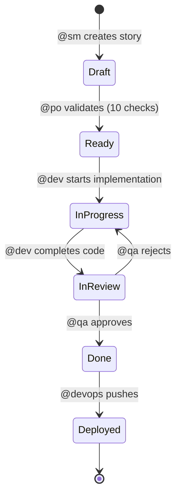

## The Story-Driven Principle

AIOX enforces **Story-Driven Development** as a constitutional MUST: no code is written without an associated story. This ensures traceability, clear requirements, and predictable outcomes.

<Warning>
  **Constitutional Rule:** Nenhum código é escrito sem uma story associada.
</Warning>

From `.aiox-core/constitution.md:56-68`:

```markdown
### III. Story-Driven Development (MUST)

Todo desenvolvimento começa e termina com uma story.

**Regras:**
- MUST: Nenhum código é escrito sem uma story associada
- MUST: Stories DEVEM ter acceptance criteria claros antes de implementação
- MUST: Progresso DEVE ser rastreado via checkboxes na story
- MUST: File List DEVE ser mantida atualizada na story
- SHOULD: Stories seguem o workflow: @po/@sm cria → @dev implementa → @qa valida → @devops push

**Gate:** `dev-develop-story.md` - BLOCK se não houver story válida
```

## Story Structure

AIOX stories follow a consistent structure that agents understand:

### Story Frontmatter

```yaml
---
story_id: FEAT-42
title: "Add user authentication"
type: feature
status: ready
priority: high
assigned_to: dev
estimated_effort: 8h
---
```

### Core Sections

<AccordionGroup>
  <Accordion title="1. Description">
    **What:** Brief description of what needs to be built
    
    **Why:** Business value and user need
    
    Example:
    ```markdown
    ## Description
    
    Users need to securely authenticate before accessing the dashboard.
    This enables personalized experiences and protects sensitive data.
    ```
  </Accordion>
  
  <Accordion title="2. Acceptance Criteria">
    Testable conditions that must be met for the story to be complete.
    
    Format: Given/When/Then
    
    Example:
    ```markdown
    ## Acceptance Criteria
    
    - [ ] **AC1:** Given I'm a registered user, When I enter correct credentials, Then I'm logged in
    - [ ] **AC2:** Given I enter wrong password, When I submit, Then I see an error message
    - [ ] **AC3:** Given I'm inactive for 30 minutes, When I try an action, Then I'm prompted to re-authenticate
    ```
  </Accordion>
  
  <Accordion title="3. File List">
    Tracks which files are modified during implementation.
    
    Example:
    ```markdown
    ## File List
    
    - [ ] src/auth/login.ts (new)
    - [ ] src/auth/session.ts (modified)
    - [ ] src/components/LoginForm.tsx (new)
    - [ ] tests/auth/login.test.ts (new)
    ```
  </Accordion>
  
  <Accordion title="4. Dev Agent Record">
    Sections updated by @dev during implementation:
    
    - **Checkboxes:** Task completion status
    - **Debug Log:** Issues encountered and solutions
    - **Completion Notes:** Summary of what was built
    - **Change Log:** List of modifications
    
    Example:
    ```markdown
    ## Dev Agent Record
    
    ### Implementation Checklist
    - [x] Set up authentication routes
    - [x] Implement session management
    - [ ] Add rate limiting
    
    ### Debug Log
    - Issue: JWT secret not loading from .env
    - Fix: Added dotenv config to app entry point
    ```
  </Accordion>
</AccordionGroup>

## Story Workflow

From `story-development-cycle.yaml:39-166`, here's the complete workflow:



### Phase 1: Story Creation

**Agent:** @sm (Scrum Master) or @po (Product Owner)

**Action:** Create story with clear scope

```yaml
step: create_story
phase: 1
agent: sm
notes: |
  Scrum Master cria a próxima story do backlog:
  - Usa task create-next-story para stories de PRD shardado
  - Define acceptance criteria claros
  - Estabelece escopo e dependências
  - Story inicia com status "Draft"

  Critérios de sucesso:
  - [ ] Story criada com título descritivo
  - [ ] Acceptance criteria definidos
  - [ ] Escopo claro e delimitado
  - [ ] Dependências identificadas
```

### Phase 2: Story Validation

**Agent:** @po (Product Owner)

**Action:** Validate story with 10-point checklist

```yaml
step: validate_story
phase: 2
agent: po
notes: |
  Product Owner valida a story com checklist de 10 pontos:

  Checklist de validação:
  - [ ] 1. Título claro e objetivo
  - [ ] 2. Descrição completa do problema/necessidade
  - [ ] 3. Acceptance criteria testáveis (Given/When/Then)
  - [ ] 4. Escopo bem definido (o que está IN e OUT)
  - [ ] 5. Dependências mapeadas
  - [ ] 6. Estimativa de complexidade adequada
  - [ ] 7. Valor de negócio identificado
  - [ ] 8. Riscos documentados
  - [ ] 9. Critérios de Done claros
  - [ ] 10. Alinhamento com PRD/Epic

  Resultado:
  - Aprovada → Status muda para "Ready"
  - Rejeitada → Retorna para SM com feedback
```

### Phase 3: Implementation

**Agent:** @dev (Developer)

**Action:** Implement story following acceptance criteria

```yaml
step: implement_story
phase: 3
agent: dev
notes: |
  Developer implementa a story:
  - Lê acceptance criteria e notas técnicas
  - Executa tasks na ordem definida
  - Atualiza checkboxes conforme progride
  - Mantém Debug Log atualizado
  - Adiciona arquivos ao File List
  - Executa testes localmente
  - Commita mudanças localmente (não faz push)

  Critérios de sucesso:
  - [ ] Todos os acceptance criteria atendidos
  - [ ] Testes passando
  - [ ] Code linted e type-checked
  - [ ] Completion Notes preenchidas
```

### Phase 4: QA Review

**Agent:** @qa (QA Engineer)

**Action:** Validate implementation against acceptance criteria

```yaml
step: qa_review
phase: 4
agent: qa
notes: |
  QA valida a implementação:
  - Verifica todos os acceptance criteria
  - Executa testes manuais quando necessário
  - Valida edge cases e error handling
  - Verifica qualidade do código

  Resultado:
  - APPROVED → Prossegue para push
  - REJECTED → Retorna para @dev com feedback detalhado
```

### Phase 5: Deployment

**Agent:** @devops (DevOps Engineer)

**Action:** Run quality gates and push to remote

```yaml
step: push_to_remote
phase: 5
agent: devops
notes: |
  DevOps executa quality gates e push:
  - npm run lint (must PASS)
  - npm run typecheck (must PASS)
  - npm test (must PASS)
  - git push to remote
  - Creates PR if needed

  Critérios de sucesso:
  - [ ] Todos os quality gates passaram
  - [ ] Push realizado com sucesso
  - [ ] Story marcada como "Deployed"
```

## Story Progress Tracking

AIOX uses checkboxes for real-time progress visibility:

```markdown
## Implementation Checklist

- [x] Create auth routes
- [x] Add middleware
- [x] Write tests
- [ ] Add rate limiting
- [ ] Update documentation

Status: 60% complete (3/5 tasks)
```

Agents update these checkboxes as they work, providing live progress updates.

## File List Tracking

The File List section shows which files were touched:

```markdown
## File List

- [x] src/auth/login.ts (new) - Created login endpoint
- [x] src/auth/session.ts (modified) - Added JWT validation
- [x] src/components/LoginForm.tsx (new) - Built login UI
- [ ] src/config/security.ts (new) - Pending rate limiting config
- [x] tests/auth/login.test.ts (new) - Added integration tests
```

This makes it easy to:
- Review what changed
- Identify missing files
- Generate accurate git commits
- Track code coverage

## Benefits

<CardGroup cols={2}>
  <Card title="Traceability" icon="link">
    Every line of code traces back to a story. No mystery code.
  </Card>
  
  <Card title="Clear Requirements" icon="list-check">
    Acceptance criteria define "done" before coding starts.
  </Card>
  
  <Card title="Progress Visibility" icon="chart-line">
    Checkboxes show real-time status without asking the agent.
  </Card>
  
  <Card title="Context Preservation" icon="brain">
    Stories document decisions and context for future reference.
  </Card>
</CardGroup>

## Example Story

Here's a complete story structure:

<CodeGroup>
```markdown Story Header
---
story_id: FEAT-123
title: "Add Markdown preview to editor"
type: feature
status: ready
priority: high
assigned_to: dev
estimated_effort: 4h
created_at: 2026-03-01
---

## Description

Users need to see a live preview of their Markdown content while editing
to ensure proper formatting before publishing.

## Acceptance Criteria

- [ ] **AC1:** Given I'm editing Markdown, When I type, Then I see live preview
- [ ] **AC2:** Given I use Markdown syntax, When I view preview, Then it renders correctly
- [ ] **AC3:** Given I toggle preview off, When I click toggle, Then preview hides
```

```markdown Implementation Tracking
## File List

- [ ] src/components/MarkdownEditor.tsx (new)
- [ ] src/components/MarkdownPreview.tsx (new)
- [ ] src/utils/markdown-parser.ts (new)
- [ ] tests/components/MarkdownEditor.test.tsx (new)

## Dev Agent Record

### Implementation Checklist
- [ ] Create MarkdownEditor component
- [ ] Add real-time preview rendering
- [ ] Implement toggle functionality
- [ ] Write unit tests
- [ ] Add integration tests

### Debug Log
_(Updated during implementation)_

### Completion Notes
_(Filled by @dev when complete)_
```
</CodeGroup>

## Quality Gates

The `dev-develop-story.md` task enforces story requirements:

<Steps>
  <Step title="Check Story Exists">
    BLOCK if no story file is found
  </Step>
  
  <Step title="Validate Status">
    BLOCK if story status is "Draft" - must be "Ready"
  </Step>
  
  <Step title="Verify Acceptance Criteria">
    BLOCK if no acceptance criteria defined
  </Step>
  
  <Step title="Confirm Assignment">
    WARN if story not assigned to @dev
  </Step>
</Steps>

## Anti-Patterns

<Warning>
  **Don't do this:**
  - Start coding before story is "Ready"
  - Skip acceptance criteria validation
  - Forget to update checkboxes during work
  - Leave File List empty
  - Push without QA review
</Warning>

## Related Concepts

- [Agent Authority](/concepts/agent-authority) - Who can create and validate stories
- [Workflow Orchestration](/concepts/workflow-orchestration) - How stories flow through agents
- [CLI First Architecture](/concepts/cli-first-architecture) - Why stories are files, not database records

<Card title="Create Your First Story" icon="rocket" href="/guides/create-story">
  Learn how to create and implement a story with AIOX
</Card>
