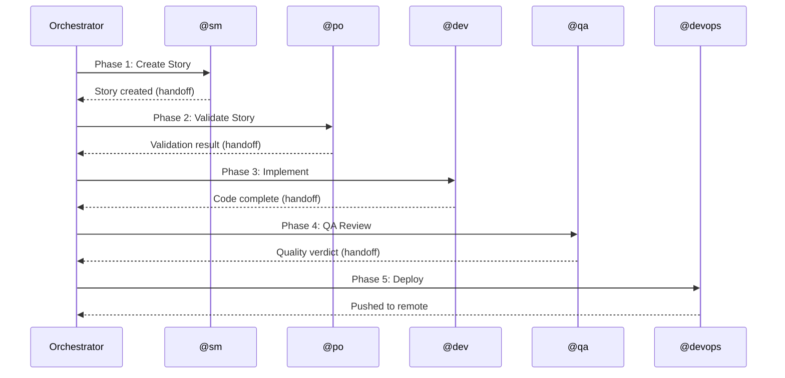

## What is Workflow Orchestration?

AIOX orchestrates multi-agent workflows where specialized agents execute phases sequentially or in parallel, with automatic context handoffs and quality gates.

<Info>
  Workflows are defined in YAML files under `.aiox-core/development/workflows/` and executed by the `WorkflowOrchestrator`.
</Info>

## Workflow Anatomy

From `.aiox-core/development/workflows/story-development-cycle.yaml:1-38`:

```yaml
workflow:
  id: story-development-cycle
  name: Story Development Cycle
  version: "1.0"
  description: >-
    Ciclo completo de desenvolvimento de stories. Automatiza o fluxo desde a criação
    até a entrega com quality gate: create → validate → implement → QA review.
  
  type: generic
  project_types:
    - greenfield
    - brownfield
    - feature-development
    - bug-fix
    - enhancement

  metadata:
    elicit: true
    confirmation_required: true

  execution_modes:
    - mode: yolo
      description: Execução autônoma com mínima interação
      prompts: 0-1
    - mode: interactive
      description: Checkpoints de decisão e feedback educacional
      prompts: 5-10
      default: true
    - mode: preflight
      description: Planejamento completo antes da execução
      prompts: "10-15"

  phases:
    - phase_1: Story Creation
    - phase_2: Story Validation
    - phase_3: Implementation
    - phase_4: QA Review
```

## Execution Phases

Each workflow consists of phases executed by specialized agents:



## Phase Structure

Each phase follows a consistent pattern:

```yaml
- step: implement_story
  id: implement
  phase: 3
  agent: dev                    # Which agent executes this
  action: Desenvolver story     # What the agent does
  task: develop-story.md        # Task file with instructions
  requires: validate            # Dependencies (previous phases)
  creates:                      # Expected outputs
    - src/**/*.ts
    - tests/**/*.test.ts
  notes: |                      # Context and requirements
    Developer implementa a story:
    - Lê acceptance criteria
    - Executa tasks sequencialmente
    - Atualiza checkboxes
    - Commita localmente
  outputs:                      # Handoff data
    - implementation_summary
    - changed_files
  next: qa_review               # Next phase
```

## Workflow Orchestrator

The `WorkflowOrchestrator` class manages workflow execution:

```javascript workflow-orchestrator.js:31-81
class WorkflowOrchestrator {
  constructor(workflowPath, options = {}) {
    this.workflowPath = workflowPath;
    this.options = {
      yolo: options.yolo || false,
      executionProfile: options.executionProfile || null,
      executionContext: options.executionContext || 'development',
      parallel: options.parallel !== false,
      onPhaseStart: options.onPhaseStart || this._defaultPhaseStart.bind(this),
      onPhaseComplete: options.onPhaseComplete || this._defaultPhaseComplete.bind(this),
      dispatchSubagent: options.dispatchSubagent || null,
      projectRoot: options.projectRoot || process.cwd(),
      confidenceThreshold: this._resolveConfidenceThreshold(options.confidenceThreshold),
      enableConfidenceGate: options.enableConfidenceGate !== false,
    };

    this.workflow = null;
    this.promptBuilder = new SubagentPromptBuilder(this.options.projectRoot);
    this.contextManager = null;
    this.parallelExecutor = new ParallelExecutor();
    this.checklistRunner = new ChecklistRunner(this.options.projectRoot);

    // V3.1: Pre-flight detection and skill dispatch components
    this.techStackDetector = new TechStackDetector(this.options.projectRoot);
    this.skillDispatcher = new SkillDispatcher(this.options);
    this.conditionEvaluator = null;
    this.techStackProfile = null;
    this.executionProfile = resolveExecutionProfile({
      explicitProfile: this.options.executionProfile,
      context: this.options.executionContext,
      yolo: this.options.yolo,
    });

    // Execution state
    this.executionState = {
      startTime: null,
      currentPhase: 0,
      completedPhases: [],
      failedPhases: [],
      skippedPhases: [],
    };
  }
}
```

## Lifecycle Hooks

Workflows support lifecycle hooks for custom behavior:

### Pre-Phase Hooks

Run **before** agent dispatch:

```yaml
preActions:
  - type: mkdir
    path: docs/architecture
    blocking: true
  
  - type: check_env
    vars:
      - GITHUB_TOKEN
      - DATABASE_URL
    blocking: true
  
  - type: file_exists
    path: docs/prd/PRD.md
    blocking: false
```

From `workflow-orchestrator.js:141-176`:

```javascript
async preparePhase(phase) {
  const results = { preActions: [], errors: [] };

  // 1. Create output directory if needed
  if (phase.creates) {
    const creates = Array.isArray(phase.creates) ? phase.creates : [phase.creates];
    for (const outputPath of creates) {
      const dir = path.dirname(outputPath);
      const fullDir = path.join(this.options.projectRoot, dir);
      await fs.ensureDir(fullDir);
      results.preActions.push({ type: 'mkdir', path: dir, success: true });
    }
  }

  // 2. Execute preActions if defined
  if (phase.preActions) {
    for (const action of phase.preActions) {
      try {
        const actionResult = await this._executePreAction(action);
        results.preActions.push({ ...action, success: actionResult.success });
      } catch (error) {
        results.errors.push({ action, error: error.message });
        if (action.blocking !== false) {
          throw new Error(`Pre-action failed: ${action.type} - ${error.message}`);
        }
      }
    }
  }

  // 3. Load checklist if defined (for post-validation)
  if (phase.checklist) {
    this._currentChecklist = phase.checklist;
  }

  return results;
}
```

### Post-Phase Hooks

Run **after** agent completes:

```yaml
postActions:
  - type: file_exists
    path: docs/architecture/SYSTEM_DESIGN.md
    blocking: true
  
  - type: min_file_size
    path: docs/architecture/SYSTEM_DESIGN.md
    minKb: 1
    blocking: true
  
  - type: run_checklist
    checklist: architecture-quality
    targetPath: docs/architecture/
```

From `workflow-orchestrator.js:221-289`:

```javascript
async validatePhaseOutput(phase, _result) {
  const validation = { passed: true, checks: [], errors: [] };

  // 1. Check if output files were created
  if (phase.creates) {
    const creates = Array.isArray(phase.creates) ? phase.creates : [phase.creates];
    for (const outputPath of creates) {
      const fullPath = path.join(this.options.projectRoot, outputPath);
      const exists = await fs.pathExists(fullPath);
      validation.checks.push({
        type: 'file_exists',
        path: outputPath,
        passed: exists,
      });
      if (!exists) {
        validation.passed = false;
        validation.errors.push(`Output not created: ${outputPath}`);
      }
    }
  }

  // 2. Execute postActions if defined
  if (phase.postActions) {
    for (const action of phase.postActions) {
      try {
        const actionResult = await this._executePostAction(action);
        validation.checks.push({ ...action, passed: actionResult.success });
        if (!actionResult.success) {
          validation.passed = false;
          validation.errors.push(`Post-action failed: ${action.type}`);
        }
      } catch (error) {
        validation.passed = false;
        validation.errors.push(`Post-action error: ${error.message}`);
      }
    }
  }

  // 3. Run checklist if defined
  if (this._currentChecklist) {
    try {
      const checklistResult = await this.checklistRunner.run(
        this._currentChecklist,
        phase.creates,
      );
      validation.checks.push({
        type: 'checklist',
        checklist: this._currentChecklist,
        passed: checklistResult.passed,
        items: checklistResult.items,
      });
      if (!checklistResult.passed) {
        validation.passed = false;
        validation.errors.push(`Checklist failed: ${this._currentChecklist}`);
      }
    } catch (error) {
      console.log(chalk.yellow(`   ⚠️ Checklist error: ${error.message}`));
    }
    this._currentChecklist = null;
  }

  return validation;
}
```

## Context Manager and Handoffs

The `ContextManager` handles state persistence and agent handoffs:

```javascript context-manager.js:1-50
class ContextManager {
  constructor(workflowId, projectRoot) {
    this.workflowId = workflowId;
    this.projectRoot = projectRoot;

    // State file path
    this.stateDir = path.join(projectRoot, '.aiox', 'workflow-state');
    this.statePath = path.join(this.stateDir, `${workflowId}.json`);
    this.handoffDir = path.join(this.stateDir, 'handoffs');
    this.confidenceDir = path.join(this.stateDir, 'confidence');

    // In-memory cache
    this._stateCache = null;
  }

  async ensureStateDir() {
    await fs.ensureDir(this.stateDir);
    await fs.ensureDir(this.handoffDir);
    await fs.ensureDir(this.confidenceDir);
  }

  async savePhaseOutput(phaseNum, output, options = {}) {
    const state = await this.loadState();
    const completedAt = new Date().toISOString();
    const handoff = this._buildHandoffPackage(phaseNum, output, state, options, completedAt);

    state.phases[phaseNum] = {
      ...output,
      completedAt,
      handoff,
    };
    state.metadata = state.metadata || {};
    state.metadata.delivery_confidence = this._calculateDeliveryConfidence(state);

    this._stateCache = state;
    await this._saveState();
    await this._saveHandoffFile(handoff);
    await this._saveConfidenceFile(state.metadata.delivery_confidence);
  }

  async getContextForPhase(phaseNum) {
    const state = await this.loadState();

    const previousPhases = {};
    for (let i = 1; i < phaseNum; i++) {
      if (state.phases[i]) {
        previousPhases[i] = state.phases[i];
      }
    }

    return {
      workflowId: this.workflowId,
      currentPhase: phaseNum,
      previousPhases,
      previousHandoffs,
      metadata: state.metadata,
    };
  }
}
```

### Handoff Package Structure

From `context-manager.js:283-300`:

```javascript
_buildHandoffPackage(phaseNum, output, state, options, completedAt) {
  const handoffTarget = options.handoffTarget || {};
  const decision = this._extractDecisionLog(output);
  const evidence = this._extractEvidenceLinks(output);
  const risks = this._extractOpenRisks(output);

  return {
    version: '1.0.0',
    workflow_id: this.workflowId,
    generated_at: completedAt,
    from: {
      phase: phaseNum,
      agent: output.agent || null,
      action: output.action || null,
      task: output.task || null,
    },
    to: {
      phase: handoffTarget.phase || null,
      agent: handoffTarget.agent || null,
    },
    context: {
      decisions: decision,
      evidence: evidence,
      open_risks: risks,
    },
    artifacts: {
      created_files: output.creates || [],
      modified_files: output.modified || [],
      validation_results: output.validation || null,
    },
  };
}
```

## Parallel Execution

Phases can execute in parallel when there are no dependencies:

```yaml
orchestration:
  parallel_phases:
    - 3  # Phase 3 can run in parallel
    - 4  # Phase 4 can run in parallel
```

From `workflow-orchestrator.js:450-468`:

```javascript
async _executeParallelPhases(phases) {
  console.log(chalk.yellow(`\n⚡ Executing ${phases.length} phases in parallel...`));

  const phasePromises = phases.map((phase) => this._executeSinglePhase(phase));
  const results = await Promise.allSettled(phasePromises);

  // Process results
  results.forEach((result, index) => {
    if (result.status === 'rejected') {
      console.log(chalk.red(`   Phase ${phases[index].phase} failed: ${result.reason}`));
    }
  });

  return results;
}
```

## Conditional Execution

Phases can be conditionally skipped based on project state:

```yaml
- step: setup_database
  phase: 5
  agent: data-engineer
  action: Design database schema
  condition: project_has_database
```

From `workflow-orchestrator.js:474-504`:

```javascript
async _executeSinglePhase(phase) {
  const phaseNum = phase.phase;
  const phaseName = phase.phase_name || `Phase ${phaseNum}`;

  // Check conditions using ConditionEvaluator
  if (phase.condition) {
    const conditionResult = this.conditionEvaluator
      ? this.conditionEvaluator.shouldExecutePhase(phase)
      : {
        shouldExecute: this._evaluateConditionLegacy(phase.condition),
        reason: 'legacy_evaluation',
      };

    if (!conditionResult.shouldExecute) {
      const skipReason = conditionResult.reason;
      const explanation = this.conditionEvaluator
        ? this.conditionEvaluator.getSkipExplanation(phase)
        : 'Condition not met';

      console.log(chalk.gray(`   ⏭️  Skipping ${phaseName}: ${explanation}`));
      this.executionState.skippedPhases.push(phaseNum);

      // Save skip result to context
      const skipResult = this.skillDispatcher.createSkipResult(phase, skipReason);
      await this.contextManager.savePhaseOutput(phaseNum, skipResult, {
        handoffTarget: this._getNextPhaseHandoffTarget(phaseNum),
      });

      return { skipped: true, phase: phaseNum, reason: skipReason };
    }
  }
}
```

## Workflow Intelligence

AIOX includes a **Workflow Intelligence System (WIS)** that learns patterns:

```javascript suggestion-engine.js:1-65
class SuggestionEngine {
  constructor(options = {}) {
    this.cacheTTL = options.cacheTTL || SUGGESTION_CACHE_TTL;
    this.lazyLoad = options.lazyLoad !== false;
    this.useLearnedPatterns = options.useLearnedPatterns !== false;
    this.learnedPatternBoost = options.learnedPatternBoost || 0.15;
    this.suggestionCache = null;
    this.cacheTimestamp = null;
    this.cacheKey = null;
  }

  async buildContext(options = {}) {
    this._loadDependencies();

    const context = {
      agentId: options.agentId || this._detectCurrentAgent(),
      lastCommand: null,
      lastCommands: [],
      storyPath: null,
      branch: null,
      projectState: {},
    };

    // Load session context if available
    if (options.autoDetect !== false && SessionContextLoader) {
      try {
        const loader = new SessionContextLoader();
        const sessionContext = loader.loadContext(context.agentId);

        context.lastCommands = sessionContext.lastCommands || [];
        context.lastCommand = context.lastCommands[context.lastCommands.length - 1] || null;
        context.storyPath = sessionContext.currentStory || null;
        context.workflowActive = sessionContext.workflowActive || null;
      } catch (error) {
        console.warn('[SuggestionEngine] Failed to load session context:', error.message);
      }
    }

    return context;
  }
}
```

The WIS learns from successful workflows and suggests next commands based on patterns.

## Built-in Workflows

AIOX includes pre-built workflows:

<CardGroup cols={2}>
  <Card title="Story Development" icon="book">
    `story-development-cycle.yaml`
    
    Complete story lifecycle from creation to deployment
  </Card>
  
  <Card title="Greenfield Fullstack" icon="rocket">
    `greenfield-fullstack.yaml`
    
    Initialize new full-stack projects with architecture and database
  </Card>
  
  <Card title="QA Loop" icon="check-circle">
    `qa-loop.yaml`
    
    Iterative QA review with feedback and re-implementation
  </Card>
  
  <Card title="Epic Orchestration" icon="layer-group">
    `epic-orchestration.yaml`
    
    Coordinate multiple stories into cohesive epics
  </Card>
</CardGroup>

## Creating Custom Workflows

Create a new workflow file:

```yaml custom-workflow.yaml
workflow:
  id: custom-workflow
  name: My Custom Workflow
  version: "1.0"
  description: Custom workflow for my use case
  
  type: custom
  project_types:
    - feature-development

sequence:
  - step: analyze
    phase: 1
    agent: analyst
    action: Analyze requirements
    creates:
      - docs/analysis/REQUIREMENTS.md
  
  - step: design
    phase: 2
    agent: architect
    action: Design system architecture
    requires: analyze
    creates:
      - docs/architecture/DESIGN.md
  
  - step: implement
    phase: 3
    agent: dev
    action: Implement features
    requires: design
    creates:
      - src/**/*.ts
```

Execute with:

```bash
aiox workflow run custom-workflow.yaml
```

## Related Concepts

- [Agent Authority](/concepts/agent-authority) - Which agents can execute which phases
- [Story-Driven Development](/concepts/story-driven-development) - How stories flow through workflows
- [CLI First Architecture](/concepts/cli-first-architecture) - Why workflows are YAML files, not UI configs

<Card title="Explore Workflows" icon="diagram-project" href="/workflows/overview">
  See all built-in workflows and learn how to customize them
</Card>
